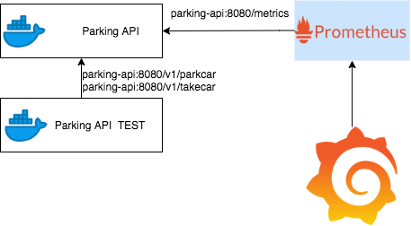
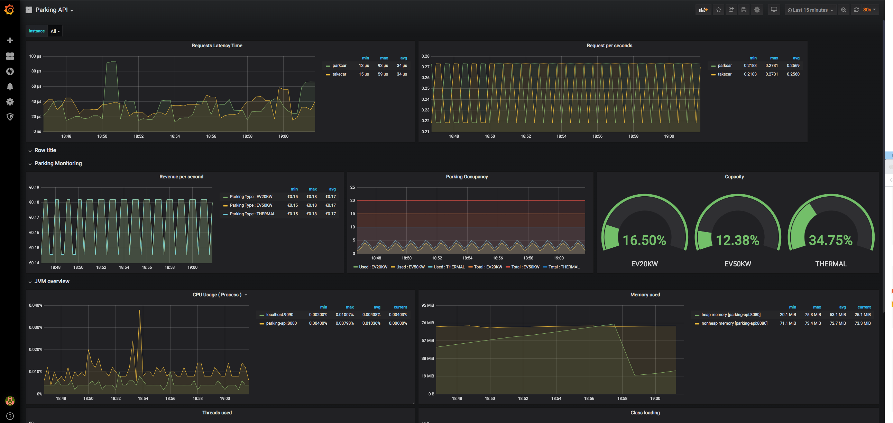

# Toll Parking Library : APIS for a Toll Parking 

Project created using:

* Java 11
* Spring Boot 2.2
* Swagger 2
* Prometheus Client 
* Mockito/ PowerMock
* Maven

! The data is not persisted !

! This is not a multi-client API, i.e., one deployment per parking lot (client) is needed !

## Requiments

Docker and docker-compose

## Building

The project build done using maven but inside a docker build image.

Like this we can assure that only the correct language version and libraries are going to be used. 

To build and start the project:

docker-compose -f docker-compose.yml up --build

This will build the ParkingAPI and the ParkingAPI-TEST images. The compose will also download also Prometheus and Grafana.

## Architecture

## Project

This projects provides two services :

parkcar :  That will reserve a parking spot based on the car type.
takecar :  Will release the occupied slot and return the amount to be paid.

for both services the Payload should be send in POST :

{"regPlate": "BM-009-GT", "type": "EV20KW"}

The API is documented using Swagger 2 and is available after the container start :

http://localhost:8080/swagger-ui.html

### Project Configuration

The project configuration is done  using an application.property file, that is passed as an argument in the docker container.

If you want to modify the configuration, please update the docker-compose.yml, service parking-api, with the correct file path.

#### Parking Setup

The parking setup is done using the configuration file, where you can set the number of spots per spot type.

#### Pricing Policy 

For the moment we have only 2 price policies available.
Future pricing policy can be done implementing the PricingService Interface.

The selected pricing policy will be selected using also the application.properties file.

## Testing

Unit tests done with JUnit , using Mockito and Powermock for "mocks" and some reflection magic ( I know, this is bad :/ ).

A container for the Integration test is available in the docker-compose, with an ugly bash "testServices.sh" that will be non-stop requests to emulate
some traffic.

Test coverage around 80%.

Used SonarLint for quality check.

## Monitoring
The Application is setup to be monitored using Prometheus and Grafana.

Accessing http://localhost:3000/d/E3G83l9Wk/parking-api ( user: admin , pwd: admin ) you will have available a dashboard including technical and functional KPIs like:

JVM related metrics

API latency time

Parking Revenue per seconds

Parking Occupancy

## Improvements
* Implement Authentication (OAuth would be ok)
* Add proper logs
* Split the application in two different apps , Parking and Pricing , in a more microservice approach.
* Persist data
 